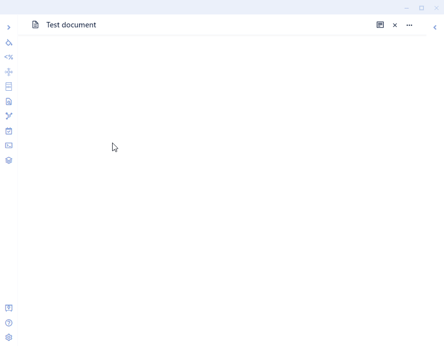

# Obsidian-WordNet
WordNet plugin for Obsidian.  WordNet is a large lexical database of English terms developed by Princeton University and its license allows use in other applications.

Learn more by reading the documentation: https://tfthacker.com/wordnet

# Instructions
The WordNet dictionary can be accessed either through the command palette or the WordNet button on the ribbon. 

Once invoked, WordNet will allow you to input the word you want to look up. As you type, options are shown. Once you find the word that interests you, you can press enter to have it inserted into the current document. If the current document is in preview mode, the definition will be displayed in a notification window for about 10 seconds.

## Say Thank You
If you are interested in reading articles written by me, please check out my articles on Medium: https://bit.ly/o42-medium.

If you are enjoying this plugin then feel free to buying me a coffee on [https://ko-fi/TfTHacker](https://ko-fi.com/TfTHacker).

Please also help spread the word by sharing your enthusiasim for this plugin on Twitter, Reddit, or any other social media platform you regularly use. 

You can find me on Twitter [@TfTHacker](https://twitter.com/TfTHacker)

